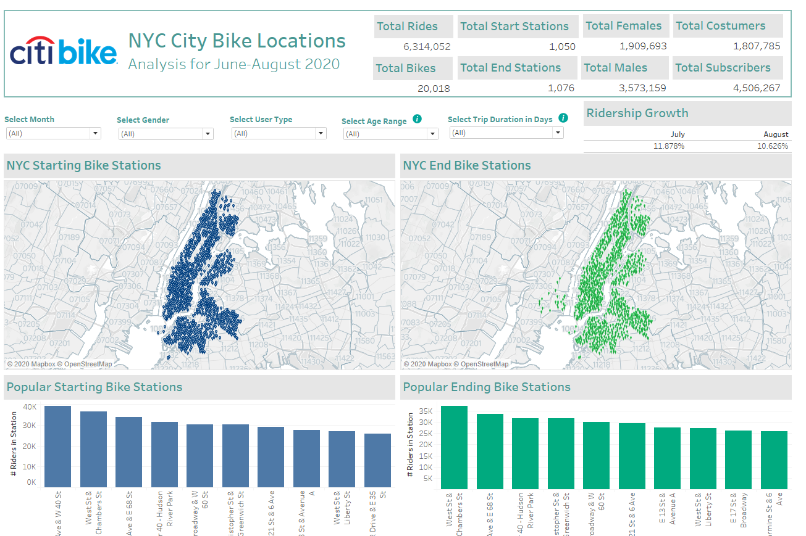

# Tableau Challenge
## Introduction
Since 2013, the Citi Bike Program in New York City has implemented a robust infrastructure for collecting data on the program's utilization. Through the team's efforts, each month bike data is collected, organized, and made public on the Citi Bike Data webpage.
A series of dashboards are needed to understand the data and provide the ability to the city officials to make decisions. The following work was made in Tableau to analysis the CityBike data from June-August, 2020.

## Results
## Files Location

The published version of Tableau is located at: https://public.tableau.com/profile/adriana3541#!/vizhome/NYC-CityBikeAnalysis/Story?publish=yes
The Tableau original file is located at:
https://drive.google.com/drive/folders/1MO9aP5UabuZ2ZUQyRNR73VGFLsyhtJB0

## General Facts
* Trips between June-August 2020: 6,314,052
* Percentage of ridership growth: 11.8% in July and 10.6% in August
* Proportion of short-term customers and annual subscribers: 28.63% and 71.37%
* Peak hours in which bikes are used during the months of study: 4-7pm
* Top 5 stations in the city for starting a journey: 12 Av & W 40St, West St & Chambers St, 1 Ave & 68St, Pier 40-Hudson River Park, Broadway & W60St
* Top 5 stations in the city for ending a journey: West St & Chambers St, 1 Ave & 68St, Pier 40-Hudson, Christopher St & Greenwich St, Broadway & W60St
* Gender Breakdown of active participants: 30% females, 56% Males
* Female ridership has been increasing between 8 and 9% for July and August, 2020. Male ridership has increased 14.8% and 10.9% during the same period.
* The trips duration decrease as the age of the riders increases.
* The average distance a bike is ridden is: 1.431miles

## General Observations
* In average, 56% are male riders and 30% are females 
* Peak hours are from 4 to 7pm
* 62% of the people ride for less than 20 min. 
* 50% men tend to ride up to 10min. 
* 25% of riders with trips of less than 10 minutes are women. This increases to 33% with trips up to 50minutes.
* 48% people rides for less than 1 mile
* 28% of riders are 20-40 years old. 
* 50-60 years old people ride more over early hours (0-4am).
* The older the riders the less miles and time they spend riding
* Amount of riders increase over summer months, except people 90years old+
* 45% of the riders are Customers in early hours (0-4am).
* Subscribers account for at least 51% of the riders at any time during the day, with a maximum 0f 88% at 6am.
* Number of customers increased by 14.4% in July after a decline in June
* During the weekends, Customers increase from 25% to 35% of the riders.
* The summer months see an increase of 3% month over month in riders along with the increase in temperatures.
* During rainy days, riders decrease up to 69% the usage of bikes.
* Peak hours are between 4-7pm.
* Bikes that are ridden by thousands of people ride a median distance of 1-2 miles.
* Bikes that are ridden by fewer riders have median distances above 2 miles. 
* An average recommendation for bike maintenance is at 1,250riden-miles. Lower graph shows bikes IDs in need of maintenance.

